# Fish Counting using YOLOv8 Object Detection
This project implements an automated Fish Counting System using computer vision. It leverages the Ultralytics YOLOv8 architecture to detect fish in video footage and provides a frame-by-frame count of detected objects. The model is trained on a custom dataset sourced from Roboflow.

## Project Overview
Manual counting of fish in aquaculture or underwater footage is tedious and prone to error. This project automates the process by:
1. Training a custom YOLOv8 Nano model on a specific fish dataset.
2. Detecting fish in video streams with high confidence.
3. Annotating the video with bounding boxes and a real-time counter.

## Tech Stack
ComponentTechnologyDescriptionModel ArchitectureYOLOv8 (Ultralytics)Used yolov8n.pt (Nano) for fast inference.Image ProcessingOpenCV (cv2)For drawing bounding boxes and video I/O.Dataset ManagementRoboflowUsed for dataset versioning and downloading.EnvironmentPython / Google ColabExecution environment with GPU support.

## Workflow

```mermaid
graph TD
    A["Download Dataset (Roboflow)"] --> B["Data Preparation"]
    B --> C["Train YOLOv8n Model"]
    C -->|80 Epochs| D["💾 Weights: best.pt"]
    D --> E["Input Video"]
    E --> F["Inference & Detection"]
    F --> G{"Is Class == 'Fish'?"}
    G -->|Yes| H["Draw Box & Increment Count"]
    G -->|No| F
    H --> I["Save Annotated Video"]
```


## Dataset & Training
- Source: Roboflow (Workspace: thongfaa, Project: final-mz8zy-zx0kv)
- Model: YOLOv8 Nano (yolov8n.pt)
- Hyperparameters:
  - Epochs: 80
  - Image Size: 640
  - Batch Size: Auto
- Training Outputs: The script automatically generates confusion matrices and training loss curves (results.png) to evaluate performance.

## How to Run
1. Install Dependencies
```bash
pip install ultralytics roboflow numpy==1.26.46.
```
2. Train the Model
The script downloads the dataset and starts training automatically:
```bash
from ultralytics import YOLO

model = YOLO('yolov8n.pt')
results = model.train(data='/content/final-2/data.yaml', epochs=80, imgsz=640)
```

3. Run Inference (Video Processing)
To detect and count fish in a new video:
```bash
Python# The script defines a function 'process_video'
process_video(
    input_path='path/to/video.mp4', 
    model=trained_model, 
    output_path='output/result.mp4'
)
```

The system will output a video file with green bounding boxes and a "Fish Count" overlay.

## Results
The output video includes:
- Bounding Boxes: Green rectangles around detected fish.
- Confidence Score: Probability score for each detection.
- Total Count: A real-time counter displayed at the top-left of the frame.


## Note on Logic
Currently, the counting logic works on a per-frame basis (it counts how many fish are visible in the current frame). It does not track unique IDs across frames (e.g., if a fish swims out and back in, it might be counted again).
